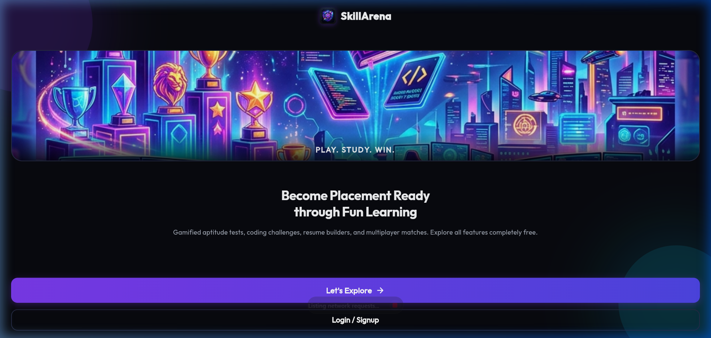
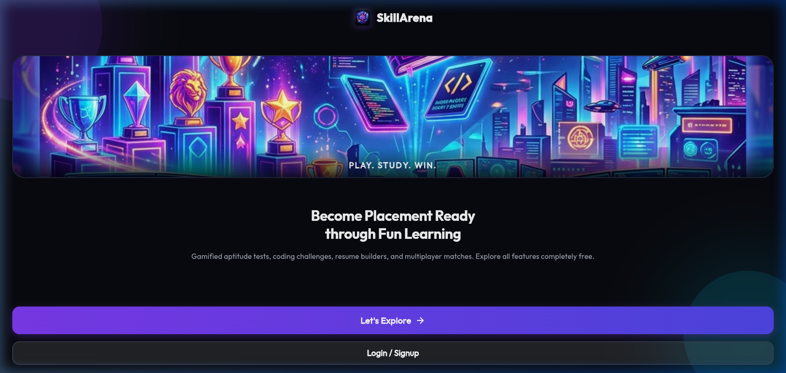
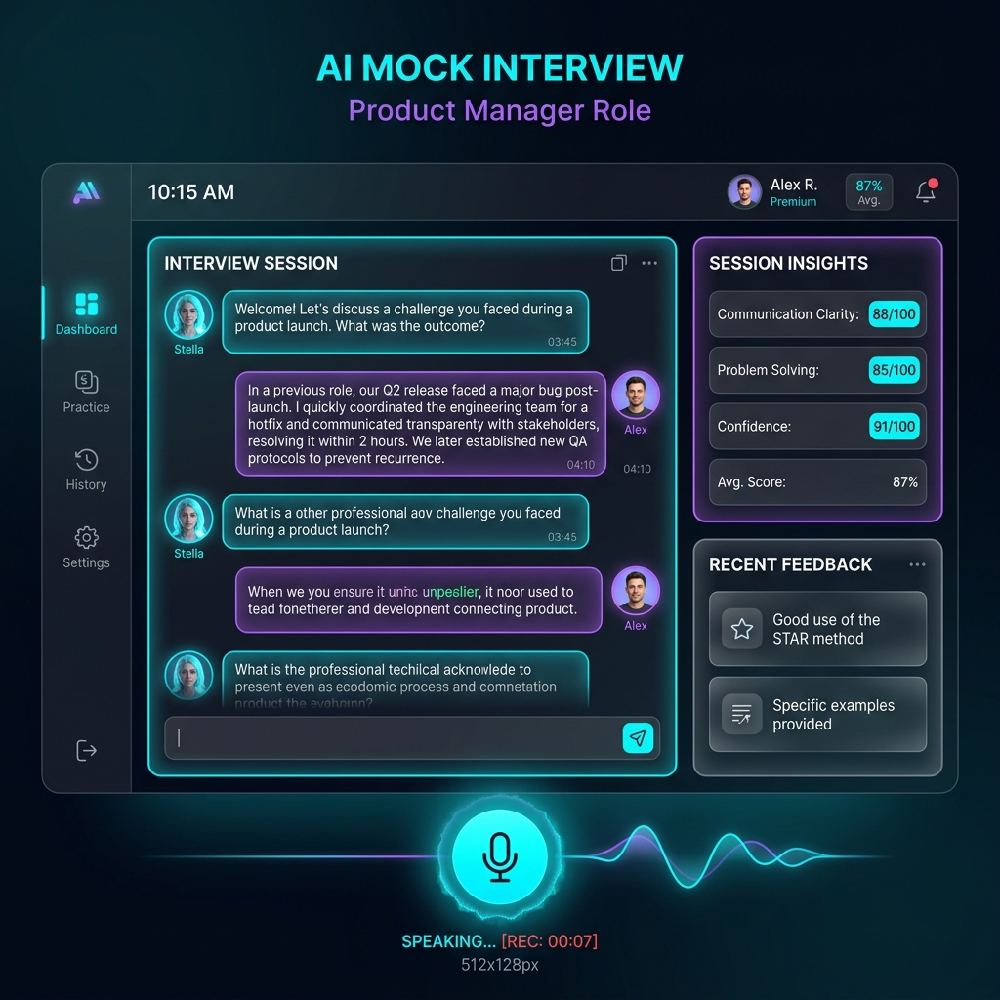
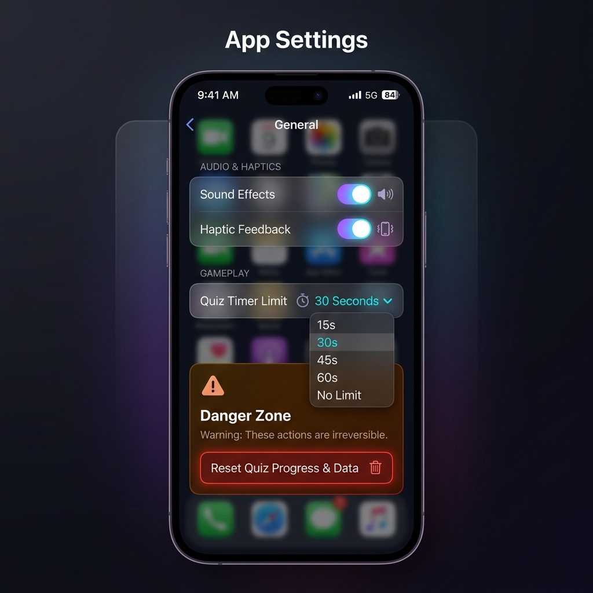

# 🏆 SkillArena - Placement Prep Hub

SkillArena is a gamified placement preparation platform designed to help students and developers master key professional domains. Built with a premium, responsive glassmorphic dark-mode design system, it supports dynamic visual themes, offline workspace replicas, and interactive placement simulations.

---

## 📸 Application Interface Preview

| **Welcome Screen** | **Dashboard Hub** |
|:---:|:---:|
|  |  |

| **AI Mock Interview** | **Application Settings** |
|:---:|:---:|
|  |  |

---

## ⚡ Key Core Modules

### 1. 🤖 AI Mock Interview Simulator
- **Interactive Role Mocking**: Select target domains including Software Engineer (General SDE), Frontend Engineer, Data Scientist/AI Engineer, and HR Behavioral rounds.
- **Voice Response Simulation**: Simulated speech-to-text response mechanism with animated feedback.
- **Dynamic Scoring Rigor**: Scoring logic automatically shifts based on user selection:
  - *Lenient*: High base score (45/100) and generous metrics.
  - *Standard*: Standard evaluation criteria (35/100 base score).
  - *Strict*: Low base score (20/100) requiring keyword-validation matching to earn score marks.

### 2. ⚙️ Advanced Application Settings Dashboard
- **Tactile Switches**: Control sound effects and vibration simulator events globally.
- **Timed Quiz Controls**: Adjust timed aptitude quiz countdown durations (10s, 20s, or 30s) on the fly.
- **Cloud & Offline Sync Control**: Toggle real-time Firebase DB syncing and wipe local synchronization logs cache.
- **Danger Zone**: Hard confirmation wipe protocol that resets user streak, coin balance, XP levels, unlocked badges, and resume templates.

### 3. 📄 Dynamic Resume Builder & Compiler
- **Modular Inputs**: Dynamically manage multiple project cards and professional experiences.
- **Local Disk Compiler**: Compiling generates a stylized, text-based output file (`_resume.txt`) saved on disk in the project root under the `output_resumes/` folder.
- **Backward-Compatible Preview**: Live preview cards handle legacy single-item structures and multi-item schemas seamlessly.

### 4. ⚔️ Aptitude & Coding Arenas
- **Timed Challenges**: Cover Percentage, Profit & Loss, Time & Work, Blood Relations, and English Synonyms.
- **Multiplayer Mode**: Face-off against rival bots or local players in Tic-Tac-Toe and Ludo.
- **Visual DB Console logs**: Prints detailed Firebase Realtime Database path sync logs instantly on the user dashboard.

### 5. 🎨 Custom Visual Styles & Themes
- Switch instantly between **Cyberpunk Violet**, **Forest Matrix**, **Sunset Synthwave**, and **Glacier Ice** themes.
- Root UI updates dynamically on theme selection and caches values using local preferences.

---

## 🛠️ Technology Stack

- **Framework**: [Flutter](https://flutter.dev) (Multiplatform Support - Web, Android, iOS)
- **Programming Language**: [Dart](https://dart.dev) (Null-Safety)
- **State Management**: [Provider](https://pub.dev/packages/provider)
- **Local Cache Database**: [SharedPreferences](https://pub.dev/packages/shared_preferences)
- **Cloud Replica**: Firebase Realtime Database Mock Layer / API integration
- **Styling**: Vanilla HSL Color Palettes, Glassmorphism, and Custom Physics Animations

---

## 🚀 Getting Started (Installation)

### Prerequisites
Make sure you have the Flutter SDK configured on your local machine:
```bash
# Verify your Flutter installation
flutter doctor
```

### Installation Steps

1. **Clone the repository**:
   ```bash
   git clone https://github.com/pritdhanani10/SkillArena.git
   cd SkillArena/skillarena
   ```

2. **Fetch project dependencies**:
   ```bash
   flutter pub get
   ```

3. **Run the application on Web/Chrome**:
   ```bash
   flutter run -d chrome
   ```

4. **Build the production web bundle**:
   ```bash
   flutter build web
   ```

---

## 📂 Project Structure

```text
skillarena/
├── assets/
│   └── images/                       # UI visual banners, logo & screenshots
├── lib/
│   ├── core/
│   │   ├── routes/
│   │   │   └── routes.dart           # Global route definitions
│   │   └── theme/
│   │       └── theme.dart            # Dynamic glassmorphism style tokens
│   ├── features/
│   │   ├── aptitude/                 # Aptitude menu & timed quiz screens
│   │   ├── brain_training/           # Memory & pattern memory card modules
│   │   ├── coding/                   # Coding challenges & MCQs
│   │   ├── home/                     # Main dashboard tab layouts
│   │   ├── onboarding/               # Welcome, login & registration flows
│   │   ├── placement/                # AI job match, resume builder, mock interviews
│   │   ├── premium/                  # Premium billing & VIP features
│   │   └── profile/                  # Performance stats, theme cards & settings
│   ├── shared/
│   │   └── widgets/                  # Staggered animations & mock ad banners
│   └── main.dart                     # App entry point
└── pubspec.yaml                      # App configuration and assets maps
```
